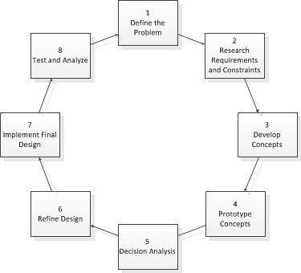

<!--  -->

Processes are just recommendations. Adapt as needed.

1. Define the Problem

   - Questions
      - What is the problem?
      - Why is it a problem?
   - Actions
      - Our existing differential tank drivetrain does not survive the rigors of multiple competition events
      - Instead of spending time improving other portions of the robot, we instead spend too much time making sure the drivetrain is 100% working
   - Outcome
      - We need a robust, reliable, yet easily servicable differential tank drive train

2. Research Requirements

   - Questions:
      - How have others solved similar problems?
         - Other robot designs
         - Commercial Off The Shelf (COTS) parts
         - Custom parts
       - What external and internal restrictions are there?
         - Rulebook
         - Cost
         - Team Capability/Manufacturability
         - Component Shipping time
   - Actions
      - From looking at multiple successful teams' robots and discussions on CD ([1](https://www.chiefdelphi.com/forums/showthread.php?t=152211), [2](https://www.chiefdelphi.com/forums/showthread.php?t=94288), [3](https://www.chiefdelphi.com/forums/showthread.php?t=124538), we noticed most teams use aluminum box tubing, cantilever all wheels, direct drive one wheel, some form of tensioning.
      - We also found teams vary with selections of gearboxes/transmissions (gear reduction, number of motors, shifting), wheels (sizes and types), belts vs chains.
      - From the rulebook, we are restricted on components, size, weight and power.
      - From a cost standpoint, the more we make in house the cheaper the total cost, *generally*.
         - It is also easier to cut plastics then metal, and machining thinner aluminum is far easier than machining a block of aluminum.
   - Outcome
      - Set of Recommended Requirements
         - For WCD:
            - Easily servicable wheels, chain/belts, transmissions
            - Robust and Reliable to last more than a competition season
            - Cantilevered Wheels
            - Manufacture in house where possible
            - Use Center to Center calculators for [Belts](http://www.wcproducts.net/how-to-belts/), [Chains](http://www.botlanta.org/converters/dale-calc/sprocket.html), and [Gears](http://www.wcproducts.net/how-to-gears/) to ensure proper spacing and prevent wear
            - Use Gearbox Calculators to determine gear ratios and desired FPS - [WCProducts](http://www.wcproducts.net/how-to-drivetrain/) and [JVN Design Calculator](https://1drv.ms/x/s!AprigkKMKYgtgalQQPmc59XpZ3NQuQ)
            - Support for various wheel setups (omni/traction, 6 vs 8, etc) and various transmissions (2 vs 3 CIM, etc)
      - These could be rewritten to rank them in importance, however best fits the deisgn goals. 1-5, Needs vs Wants, etc.

3. Develop Concepts

   - Questions:
      - How will the solution meet the requirements and constraints?
         - From lots of ideas come a few great ones
      - How can those ideas be refined to develop concept sketches?
         - If there's a great idea, don't be afraid ot take it and run with it. Start sketching/modelling it in Creo, start finding specific parts, start working out the details, etc.

   - Actions:
      - Brainstorm ideas as groups
         - No bad ideas, quantity over quality at this point
         - Consider both big picture and specific details
            - For WCD, big ideas could revolve around:
               - Gearbox placement
               - Material thickness
               - Tensioning approaches
            - Specific details could be:
               - [Vex/WCP Bearing blocks](https://www.vexrobotics.com/bearingblocks.html) with [Cam tensioners](https://www.vexrobotics.com/217-3431.html)
               - 1" x 2" x 1/8" box tubing, as it provides the needed rigidity
      - Multiple paper/quick sketches of key requirements
         - Start with the basics
            - "For these specific 4" wheels, we'd want the wheels spaced x" apart, with y" of drop and z" of adjustable tensioning with belts"
         - Refine over time into a deimensional drawing calling out all dimensions needed to manufacutre/build/etc.
   - Outcome:
      - Sets of well-defined concept drawings with dimensions
         - For WCD, this could be 2-3 designs that target specific differences, perhaps in tensioning systems, wheel layouts, etc.

4. Prototype Concepts

   - Questions
      - How does each concept solution function in the real world?
      - How can the designs be refined to function better?
   
   - Actions

5. Decision Analysis

6. Refine Design

7. Implement Final Design

8. Test and Analyze

